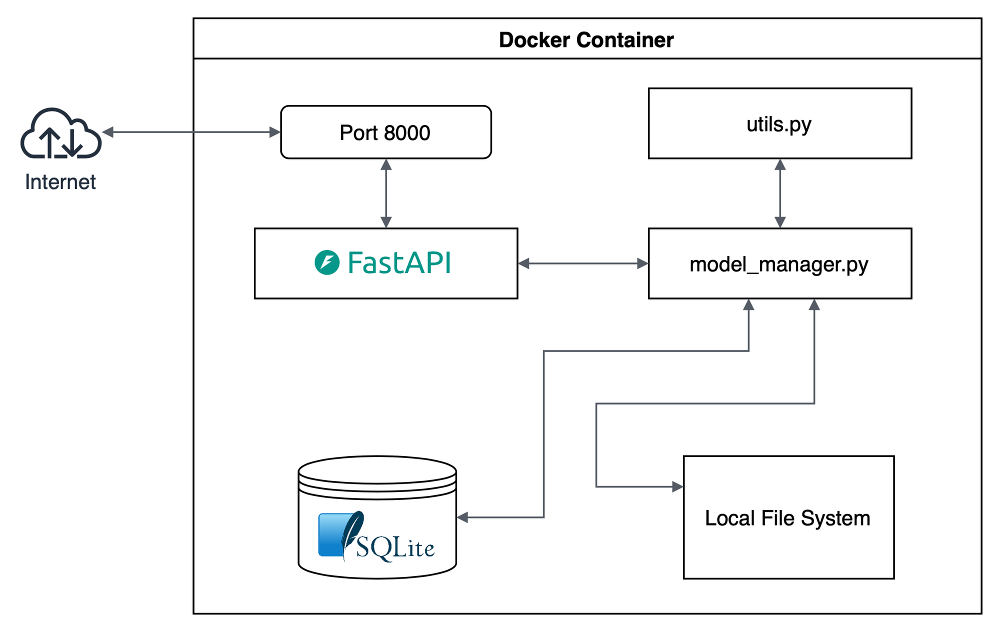
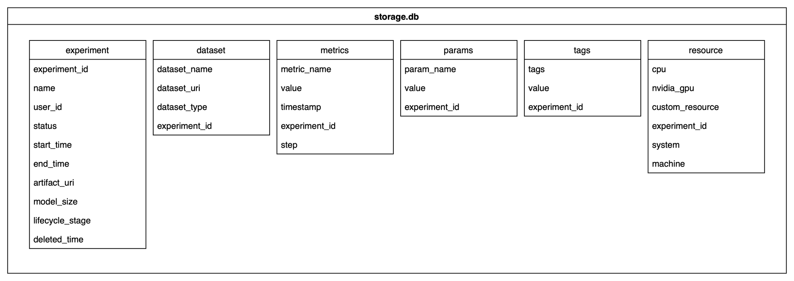
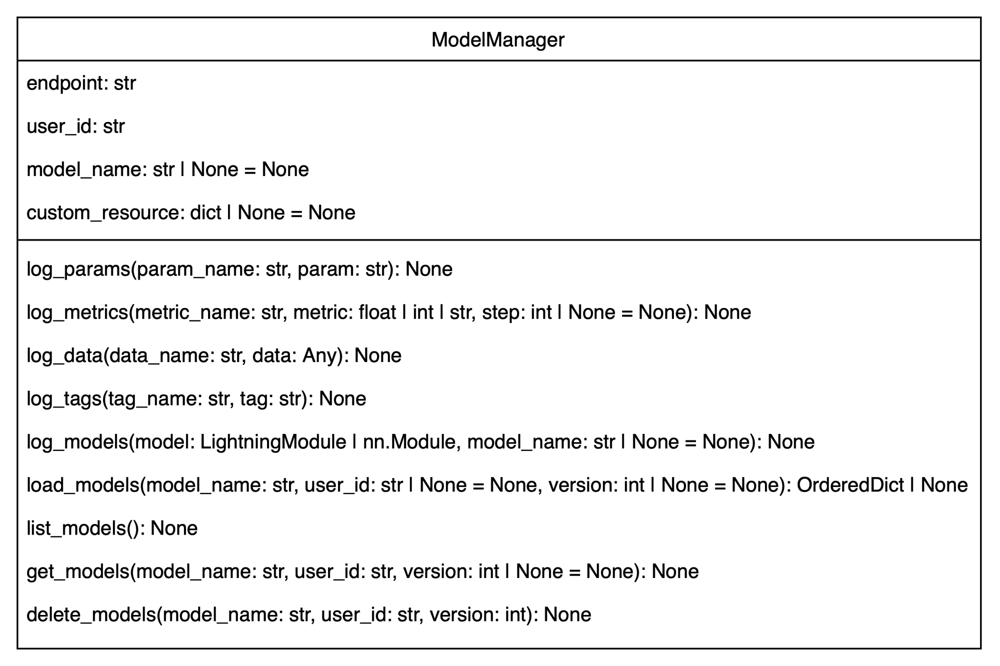

 

## Overview

#### Welcome
This project propose MLflow-like MLOps framework focusing on the checkpoint management of ML models.

#### Introduction
The primary role of the model registry is to store the trained models and manage their lifecycle. Based on below design philosophy, the author trying to design and implement the project to useful with **pythonic**, **modularization** and **kindly automation** approaches.

As a result, the project includes the follows:
- Proposal of MLOps framework configured SQLite as metadata database and local file system as artifacts storage
- Implement `log_models`, `load_models` and addtional feaures support model checkpoint management system based on proposed framework
- SDK supporting pytorch lightning and limited pytorch framework to use provided functions from the system in client side
- Tutorials, example codes and test set for understanding how to of framework and SDK

##### Design Philosophy
All design, planning and implementation in the project basically based below elements.
- Reverse engineering of MLflow and BentoML
- Process functionality in server side as possible
- Easy to use and highly guided right way SDK
</br>

## Additional Features

#### Functions

##### log_params
Log input parameter of training experiment from PyTorch Lightning `trainer`, model `__init__` and explicit definition. If model training required in local without pull of model checkpoint or need legacy training setup to do any other jobs, logged parameter of previous experiment training can be utilize.

##### log_metrics
Log metric of training experiment from training loop, callback or explicit definition. Metric of model such as accuracy or MAE are one of important judgment criteria of model drift. The logged metric data would be helpful for monitoring the model performance and managing their lifecycle.

##### log_tags
Log given tags of experiment from explicit definition or auto tagging heuristic. The auto tagging heuristic built-in in `log_model`, they parse `requirements.txt` that provided when the function called and extract representative details such as Python or PyTorch framework versions. Tags supports to decide model usage in the system directly by providing their dependency, tech stack, characteristic details.

##### log_data
Log a data used in model training from explicit definition. The `log_model` supports only Pandas DataFrame and numpy array type for now, and it stored in model repository as extension of`.pkl` and `.npy` respectively with other experiment artifacts. The data are one of important component to tracking reason of model performance and usage, therefore `log_model` make enables to do checkpoint management based on comparison of update of old, new data, and etc..

##### list_models
List all models registered in model registry. It also provides simple metadata of each model such as model name, creator, creation time and version. You can check how many models and what kind models are registered in model registry by this, it make enables to decide next jobs such as check details of specific model or upgrade the model from seeing the list.


##### get_models
Get detail metadata of specific model registered in model registry. It provide not only metadata `list_models` shows but also additional one such as model size, dataset name, tags, system info. It make enables to check detail metadata of model, if you have curious on some it listed by `list_models` without any CLI or GUI, and solve it.

##### delete_models
Delete specific model from model registry and metadata database. The `delete_models` remove all metadata in database except `experiment` table, and then all artifacts in model registry. `deleted_time` column in `experiment` table is null in normally, but when the model experiment removed it got timestamp value. It make enables to secure size of available file system size from removing un-use experiment artifact and metadata, record end to end model lifecycle.

#### Others

##### Versioning
`log_models` can take model version as argument. This serving the version to metadata database as tags, make enables to provide version control on `load_models`, `get_models`, `delete_models` etc.. Version argument of those functions is optional. If it didn't defined, the system process based on latest version. The version control is one of important component on management of checkpoint lifecycle. It could helps seamless continuous operation by such as tracking of change of models and rollback.

##### Log resources details
`log_models` automatically detect and serve resource details as metadata. Currently, auto served resources info are cpu, nvidia_gpu, system and machine, custom_resource also compatible if explicit definition provided. Depends a resource supports in model usage, compatible model different even though same model and experiment setup. The resource details make to find easily the usage suitable model.

##### Various artifacts
The system store artifacts not only model binary but also Conda environment.yaml, requirements.txt and python script file, even dataset file. Those artifacts automatically served to model registry by `log_models` function. They grow up availability of the model development system that depend to checkpoint management system and help next development based on experiments legacy.
</br>

## Getting Start
This model checkpoint management system support to run as Docker and source build. The staging_server directory contains files to run API from docker or source, and the client directory contains file for ML model train, inference and test API using the SDK. Please place each directory to suitable path before start.

#### Docker
```
cd staying_server
docker build . -t model_manager
docker run --net=host model_manager
```
Build docker image using `dockerfile` and run it. In default setting, the docker container listen model log or load request from port `8000`.

#### Source
```
cd staying_server
pip install -r requirements.txt
uvicorn app_server:app --reload
```
Install requirements using `pip` and start API with `uvicorn`.

For a tutorial using the MNIST dataset and a PyTorch-based image classification model, please refer [here](quick_start.md#Tutorial).
</br>

## System Architecture
- The system use SQLite as metadata database and local file system as artifacts storage
- The database and local file system directory setting are initialized by model_manager.py import it run when FastAPI start up
- Modularized core logic such as process of DB querying, save and load files is handled in model_manager.py
- FastAPI get requests from endpoints for each role, and process required jobs using module in the model_manager.py step by step


</br>

## Design of Model Registry

#### DB Schema
- Default name of SQLite is `storage.db`
- The database is configured with 6 tables by their roles, it named `experiment`, `dataset`, `metrics`, `params`, `tags` and `resource` respectively
- `experiment_id` column is used to unique id value crossing the total tables
- `artifact_uri` and `dataset_uri` columns have path of each file stored



#### File System Architecture
- Default directory configuration of the model registry is `model_registry/repository`
- If new model or data submitted to the system, `user_id/model_name/version` directory is generated under the `repository`, and all logged model and data are placed in the generated path
- Even if `log_models` or `log_data` does not serve version info, the system store artifacts as new latest version
- If model removed by delete_models, always `user_id/model_name/version` directory deleted (i. e. parent directory over `version ` still remain)

```
model_registry
├── repository
│   └── [user_id]
│       └── [model_name]
│           └── [version]
│               ├── model.pkl
│               └── ...
└── storage.db
```

## API Specification
| Title | URL | Port | Method | Description |
| :---: | :---: | :---: | :---: | :---: |
| Endpoint | /endpoint | 8000 | get | Inform endpoints of API per functions |
| Setup | /setup | 8000 | POST | Declare basic info on training experiment |
| Log Params | /log_params | 8000 | POST | Log the parameters of experiment setting |
| Log Metrics | /log_metrics | 8000 | POST | Log the metrics of experiment |
| Log Tags | /log_tags | 8000 | POST | Log the tags of experiment |
| Log Data | /log_data | 8000 | POST | Log the data of experiment |
| Log Models | /log_models | 8000 | POST | Log trained model from experiment |
| Load Models | /load_models | 8000 | GET | Load specific model from model registry |
| List Models | /list_models | 8000 | GET | List all models in model registry |
| Get Models | /get_models | 8000 | GET | Get detail info of specific registered model |
| Delete Models | /delete_models | 8000 | GET | Delete specific model and experiment from model registry |

#### Data Parameter
<details>
<summary>Endpoint</summary>

| Name | Type | Required | Example |
| :---: | :---: | :---: | :---: |
|  |  |  |  |
</details>
<details>
<summary>Setup</summary>

| Name | Type | Required | Example |
| :---: | :---: | :---: | :---: |
| experiment_id | string | Y | 6a78a252-625c-417d-80ac-2a316414b9d5 |
| user_id | string | Y | anonymous |
| name | string | Y | transformer |
| status | string | Y | START |
| start_time | float | Y | 1575142526.500323 |
</details>
<details>
<summary>Log Params</summary>

| Name | Type | Required | Example |
| :---: | :---: | :---: | :---: |
| param_name | string | Y | checkpoint_path |
| value | string | Y | /paht/of/checkpoint |
| experiment_id | string | Y | 6a78a252-625c-417d-80ac-2a316414b9d5 |
</details>
<details>
<summary>Log Metrics</summary>

| Name | Type | Required | Example |
| :---: | :---: | :---: | :---: |
| metric_name | string | Y | acc |
| value | integer \| float | Y | 0.1 |
| timestamp | float | Y |  |
| experiment_id | string | Y | 6a78a252-625c-417d-80ac-2a316414b9d5 |
| step | integer | N | 0 |
</details>
<details>
<summary>Log Tags</summary>

| Name | Type | Required | Example |
| :---: | :---: | :---: | :---: |
| tags | string | Y | version |
| value | string | Y | 2 |
| experiment_id | string | Y | 6a78a252-625c-417d-80ac-2a316414b9d5 |
</details>
<details>
<summary>Log Data</summary>

| Name | Type | Required | Example |
| :---: | :---: | :---: | :---: |
| request | json | Y |  |
| file | pd.DataFrame \| np.ndarray | Y |  |

`request` json schema

| Name | Type | Required | Example |
| :---: | :---: | :---: | :---: |
| dataset_name | string | Y | checkpoint_path |
| dataset_type | string | Y | pd.DataFrame |
| experiment_id | string | Y | 6a78a252-625c-417d-80ac-2a316414b9d5 |
</details>
<details>
<summary>Log Models</summary>

| Name | Type | Required | Example |
| :---: | :---: | :---: | :---: |
| request | json | Y |  |
| file | pickle | Y |  |

`request` json schema

| Name | Type | Required | Example |
| :---: | :---: | :---: | :---: |
| experiment_id | string | Y | 6a78a252-625c-417d-80ac-2a316414b9d5 |
| status | string | Y | DONE |
| end_time | float | Y | 1575142526.500323 |
| model_size | float | Y | 0.1 |
| cpu | integer | Y | 2 |
| nvidia_gpu | integer | Y | 2 |
| custom_resource | dictionary | Y | {'IPU': 2, 'DPU': 2} |
| system | string | Y | linux |
| machine | string | Y | x86_64 |
| script | string | Y |  |
| env | yaml | Y |  |
| req_txt | string | Y |  |
</details>
<details>
<summary>Load Models</summary>

| Name | Type | Required | Example |
| :---: | :---: | :---: | :---: |
| name | string | Y | transformer |
| user_id | string | Y | anonymous |
| version | integer | N | 1 |
</details>
<details>
<summary>List Models</summary>

| Name | Type | Required | Example |
| :---: | :---: | :---: | :---: |
|  |  |  |  |
</details>
<details>
<summary>Get Models</summary>

| Name | Type | Required | Example |
| :---: | :---: | :---: | :---: |
| name | string | Y | transformer |
| user_id | string | Y | anonymous |
| version | integer | N | 1 |
</details>
<details>
<summary>Delete Models</summary>

| Name | Type | Required | Example |
| :---: | :---: | :---: | :---: |
| name | string | Y | transformer |
| user_id | string | Y | anonymous |
| version | integer | Y | 1 |
| deleted_time | float | Y | 1575142526.500323 |
</details>
</br>

## Design of SDK
- Each method in the ModelManager correspond to model registry API as 1:1 except internal functions
- The `endpoint` that defines the address of the model registry and the `user_id` that one of the criteria that specifies the model or experiment, are required variables
- If the `model_name` is still unbound when the function that log something is called, the `model_name` is defined as random name
- The SDK supports usage in pytorch lightning and limited pytorch for now
- TotalLogger callback for pytorch lightning it built-in in the SDK provide logging of parameters, metrics, tags, and models automatically using ModelManager



#### Tutorial

##### Log training experiment with `pytorch_lightning.callback`
Import `ModelManager` and `TotalLogger` from the model manager SDK.
```
from model_manager_sdk import ModelManager, TotalLogger
```
Define `ModelManager`.
```
m_manager = ModelManager(endpoint='http://your_system_endpoint', user_id='your_id')
```
Define ModelManager as logger of `TotalLogger`, and pass it to `pytorch.Trainer` callback argument.
```
trainer = Trainer(
    callbacks=[TotalLogger(logger=m_manager)]
)
```
Run exepriment.
```
trainer.fit(model)
```
---
##### Load model to use in ML pipeline from model registry
Import `ModelManager` from the model manager SDK.
```
from model_manager_sdk import ModelManager
```
Define `ModelManager`.
```
m_manager = ModelManager(endpoint='http://your_system_endpoint', user_id='your_id')
```
Load model from model registry based on the model name, creator and version conditions. (if user_id and version argument are not passed in this method, the SDK use user_id what defined in ModelManager and latest version)
```
checkpoint = m_manager.load_models('your_model_name')
```
Read loaded model to defined model architecture in your code.
```
model.load_state_dict(checkpoint)
```
